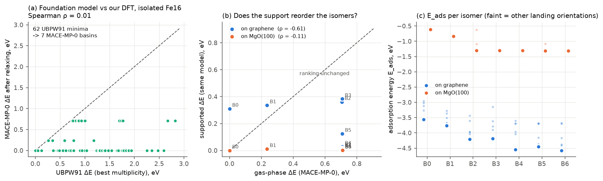
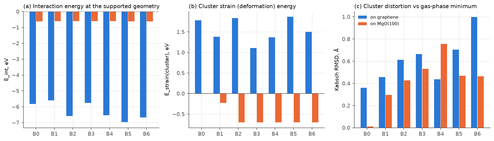
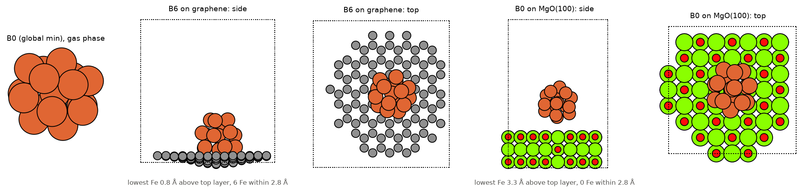
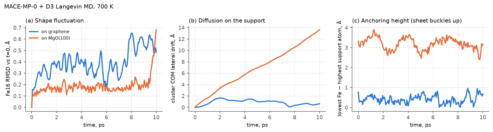
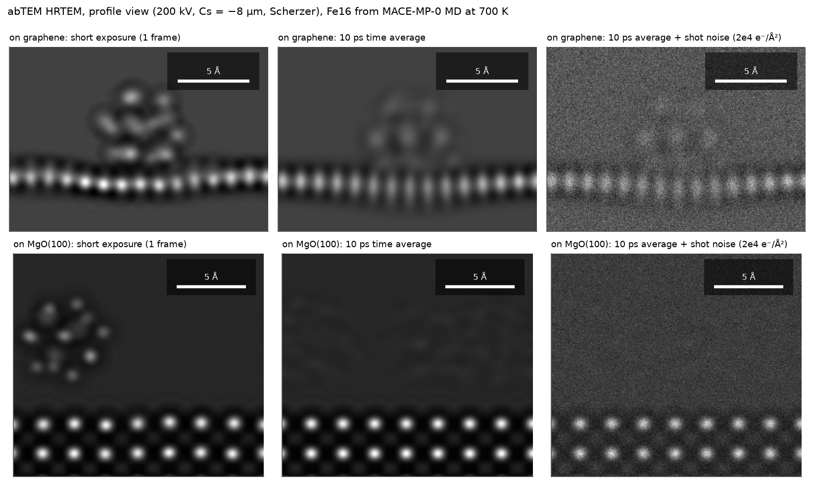
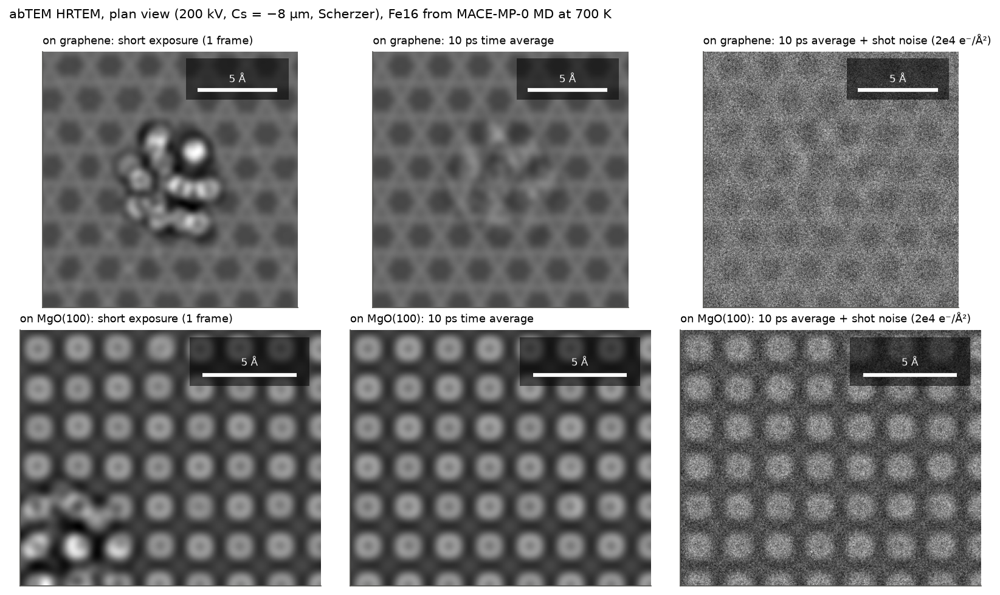

# Is the support a perturbation? Fe16 on graphene and MgO(100), imaged with abTEM

A worked example of the "step 2" idea: take clusters from the ClusterMLIP
warehouse, put them on a support, run MD, and simulate what an (in situ) TEM
would see — following the abTEM time-resolved tutorial
(<https://abtem.github.io/doc/dev/user_guide/tutorials/time_resolved.html>;
Olajide, Maxson & Szilvási, *ACS Catal.* 2025, doi:10.1021/acscatal.5c05363).

It also tests the question behind a cheap **Δ-model** for supported clusters,

    E(cluster on support) ≈ E_cluster(gas-phase model) + E_support + ΔE_interaction,

namely: *does the support only perturb the cluster, or does it reorder its
isomers?* Everything here uses **one foundation model, MACE-MP-0 medium + D3(BJ)**
(float32, laptop GPU), so every comparison is at a single level of theory. Our own
charge/spin MACE is not trained yet; this is a stand-in to exercise the pipeline.

## Pipeline

| step | script | what it does |
|---|---|---|
| 1 | `s1_select.py <seeds.extxyz>` | 668 optimised Fe16 records → 62 distinct UBPW91 minima (lowest energy over M = 49/51/53) |
| 2 | `s2_relax.py [n_orient]` | relax all 62 in the gas phase → cluster into MACE basins → land ≤ 8 basins on graphene (160 C, freestanding, one C pinned) and MgO(100) (192 atoms, 3 layers, bottom fixed), 6 random orientations each; decompose `E_ads = E_int + strain(cluster) + strain(support)` |
| 3 | `s3_md.py [fs] [supports]` | Langevin NVT, 700 K, 1 fs, 10 ps, frame every 50 fs, from the lowest supported structure |
| 4 | `s4_tem.py [supports]` | abTEM HRTEM, tutorial settings (200 kV, Cs = −8 µm, Scherzer, Cc = 1 mm, ΔE = 0.3 eV), profile and plan views: 1 frame + 12 frozen-phonon configs, 10 ps average, average + Poisson noise at 2·10⁴ e⁻/Ų |
| 5, 6 | `s5_figures.py`, `s6_tem_figs.py` | figures below |

Requirements beyond the base install: `mace-torch>=0.3.16`, `torch-dftd`, `abtem>=1.0`,
`matplotlib`, `scipy`. Outputs go to `out/` (small results are committed; MD
trajectories and image stacks are regenerated).

## Results

### 1. The foundation model does not resolve our DFT isomers

**62 UBPW91 minima collapse into 7 MACE-MP-0 basins**; 45 of them relax into the
global-minimum basin B0, and the rank correlation with UBPW91 is ρ ≈ 0 (panel a).
B2–B6 are degenerate to 2 meV — effectively one basin split only by loose
convergence on a very flat surface — which makes them useful **replicates**: the
spread of their supported energies measures the noise of the 6-orientation landing
search. MACE-MP-0 has no spin input, and much of the UBPW91 isomer structure here
is likely spin-driven, so this is not surprising; it is also the reason to use a spin-aware
model (MACE-POLAR-1 / MACE-OMOL, or our own) for the gas-phase term.

### 2. Graphene is *not* a small perturbation (in this model)

| | graphene | MgO(100) |
|---|---|---|
| E_int (frozen supported geometry) | −5.6 … −7.0 eV | −0.60 … −0.62 eV |
| cluster strain | **+1.1 … +1.9 eV** | +0.005 … −0.70 eV |
| support strain | +0.45 … +0.65 eV (sheet buckles 1.2–1.5 Å) | 0 |
| cluster RMSD vs gas minimum | 0.36 … 1.0 Å | 0.01 … 0.75 Å |
| closest Fe–support contact | 2.2 Å (Fe–C) | **3.4 Å (no Fe–O bond)** |

On graphene the cluster strain alone (1–2 eV) is larger than the gas-phase gaps
(0.24 and 0.71 eV), so the support can reorder the isomers: the gas-phase global
minimum B0 ends up 0.31 eV above the best supported structure (B6). The replicate
spread (E_ads of B2–B6: −4.19 … −4.58 eV) shows the landing search is only
converged to ~0.4 eV, so the *exact* supported order is not resolved — but the
conclusion "not a perturbation" holds well outside that noise.

**MgO(100) is a model artifact, not a result.** MACE-MP-0 leaves the cluster
3.4 Å above the surface with only D3 attraction (E_int ≈ −0.61 eV for every
isomer), whereas DFT studies of Fe on MgO(100) typically find O-site binding at ~2.0–2.1 Å with real chemical
bonding. The negative "strain" means every higher basin simply relaxed into B0
once it was nudged. Treat the MgO rows as evidence that the foundation model lacks
Fe/oxide interface chemistry — exactly the gap the ΔE_interaction term has to be
trained to fill (VASP labels).

### 3. MD and simulated TEM

On graphene at 700 K the cluster stays anchored (centre-of-mass drift ≤ 1.6 Å in
10 ps) but is fluxional (RMSD up to 0.65 Å from the starting structure). On MgO(100)
the unbound cluster hovers ~3 Å up and **slides 13.6 Å in 10 ps** (≈ 1.4 Å/ps)
while keeping its shape — the dynamical face of the missing Fe–O interaction.

As in the tutorial, a single-frame image resolves individual Fe columns, the 10 ps
average smears them, and at a realistic dose the averaged cluster is barely
distinguishable from the background — the structural dynamics are invisible on
detector timescales. On MgO the sliding cluster disappears from the averaged image
entirely. That is a cautionary example: a wrong interaction term produces a
confident-looking but spurious TEM prediction ("the cluster is too mobile to
image"), so the ΔE_interaction has to be validated before images are interpreted.

## What this means for ClusterMLIP

1. The protocol works end to end and is cheap (≈ 40 min relaxations + 30 min MD
   per support on a laptop GPU, float32).
2. The perturbation shortcut is **support-dependent and has to be checked per
   support with a model that knows the interface**. MACE-MP-0 says graphene is a
   strong perturbation and cannot say anything about MgO.
3. Next: gas-phase term from a spin-aware model (our charge/spin MACE once trained,
   or MACE-POLAR-1 checked against the UBPW91 spin ladder), and a small VASP set of
   supported Fe16 (same geometries, isolated parts at frozen geometry) to fit
   ΔE_interaction and to verify the graphene/MgO trends at the DFT level.
