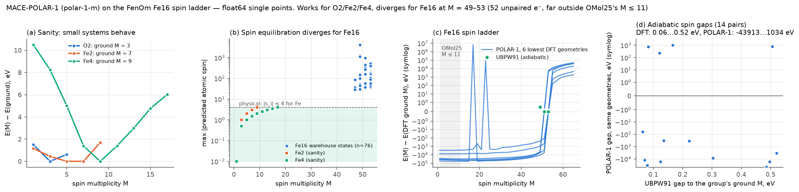

# Is the support a perturbation? Fe16 on graphene and MgO(100), imaged with abTEM

A worked example of the "step 2" idea: take clusters from the ClusterMLIP
warehouse, put them on a support, run MD, and simulate what an (in situ) TEM
would see — following the abTEM time-resolved tutorial
(<https://abtem.github.io/doc/dev/user_guide/tutorials/time_resolved.html>;
Olajide, Maxson & Szilvási, *ACS Catal.* 2025, doi:10.1021/acscatal.5c05363).

It also tests the question behind a cheap **Δ-model** for supported clusters,

    E(cluster on support) ≈ E_cluster(gas-phase model) + E_support + ΔE_interaction,

namely: *does the support only perturb the cluster, or does it reorder its
isomers?* Everything here uses **one foundation model, MACE-MP-0 medium + D3(BJ)**
(float32, laptop GPU), so every comparison is at a single level of theory. Our own
charge/spin MACE is not trained yet; this is a stand-in to exercise the pipeline.

## Pipeline

| step | script | what it does |
|---|---|---|
| 1 | `s1_select.py <seeds.extxyz>` | 668 optimised Fe16 records → 62 distinct UBPW91 minima (lowest energy over M = 49/51/53) |
| 2 | `s2_relax.py [n_orient] [model options]` | relax all 62 in the gas phase → cluster into MACE basins → land ≤ 8 basins on graphene (160 C, freestanding, one C pinned) and MgO(100) (192 atoms, 3 layers, bottom fixed), 6 random orientations each; decompose `E_ads = E_int + strain(cluster) + strain(support)` |
| 3 | `s3_md.py [fs] [supports] [model options]` | Langevin NVT, 700 K, 1 fs, 10 ps, frame every 50 fs, from the lowest supported structure |
| 4 | `s4_tem.py [supports]` | abTEM HRTEM, tutorial settings (200 kV, Cs = −8 µm, Scherzer, Cc = 1 mm, ΔE = 0.3 eV), profile and plan views: 1 frame + 12 frozen-phonon configs, 10 ps average, average + Poisson noise at 2·10⁴ e⁻/Ų |
| 5, 6 | `s5_figures.py`, `s6_tem_figs.py` | figures below |
| 7, 8, 9 | `s7_polar_spin.py <seeds> [polar-1-{s,m,l} \| model]`, `s8_polar_figs.py`, `s9_polar_breakdown.py` | MACE-POLAR-1 spin-ladder check and where it breaks (section 4); with a model path, the same ladder check for our own model |
| 10 | `s10_vasp_candidates.py [--out DIR] [--md-every N] [--spin-neighbours]` | best landings + MD snapshots → `vasp_candidates.extxyz` for `cluster-mlip vasp-prepare` (section 5) |
| 11 | `s11_delta_check.py <labels> [model options]` | compare an interaction term with the VASP ΔE_int labels, per support (section 5) |

Requirements beyond the base install: `mace-torch>=0.3.16`, `torch-dftd`, `abtem>=1.0`,
`graph_electrostatics` v0.4.0 (section 4 only),
`matplotlib`, `scipy`. Outputs go to `out/` (small results are committed; MD
trajectories and image stacks are regenerated). Runs with any other model go to
`out_<model tag>/`, under `$SUPPORTED_FE16_RUNS` when it is set; keep that on the work
drive (`D:/MLIP_Work_Folder/Cluster_MLIP/supported_fe16_runs`), not in the repo, and
point s4–s6 at a run with `EXAMPLE_OUT=<dir>`.

## Results

### 1. The foundation model does not resolve our DFT isomers

**62 UBPW91 minima collapse into 7 MACE-MP-0 basins**; 45 of them relax into the
global-minimum basin B0, and the rank correlation with UBPW91 is ρ ≈ 0 (panel a).
B2–B6 are degenerate to 2 meV — effectively one basin split only by loose
convergence on a very flat surface — which makes them useful **replicates**: the
spread of their supported energies measures the noise of the 6-orientation landing
search. MACE-MP-0 has no spin input, and much of the UBPW91 isomer structure here
is likely spin-driven, so this is not surprising; it is also the reason to use a spin-aware
model (MACE-POLAR-1 / MACE-OMOL, or our own) for the gas-phase term.

### 2. Graphene is *not* a small perturbation (in this model)

| | graphene | MgO(100) |
|---|---|---|
| E_int (frozen supported geometry) | −5.6 … −7.0 eV | −0.60 … −0.62 eV |
| cluster strain | **+1.1 … +1.9 eV** | +0.005 … −0.70 eV |
| support strain | +0.45 … +0.65 eV (sheet buckles 1.2–1.5 Å) | 0 |
| cluster RMSD vs gas minimum | 0.36 … 1.0 Å | 0.01 … 0.75 Å |
| closest Fe–support contact | 2.2 Å (Fe–C) | **3.4 Å (no Fe–O bond)** |

On graphene the cluster strain alone (1–2 eV) is larger than the gas-phase gaps
(0.24 and 0.71 eV), so the support can reorder the isomers: the gas-phase global
minimum B0 ends up 0.31 eV above the best supported structure (B6). The replicate
spread (E_ads of B2–B6: −4.19 … −4.58 eV) shows the landing search is only
converged to ~0.4 eV, so the *exact* supported order is not resolved — but the
conclusion "not a perturbation" holds well outside that noise.

**MgO(100) is a model artifact, not a result.** MACE-MP-0 leaves the cluster
3.4 Å above the surface with only D3 attraction (E_int ≈ −0.61 eV for every
isomer), whereas DFT studies of Fe on MgO(100) typically find O-site binding at ~2.0–2.1 Å with real chemical
bonding. The negative "strain" means every higher basin simply relaxed into B0
once it was nudged. Treat the MgO rows as evidence that the foundation model lacks
Fe/oxide interface chemistry — exactly the gap the ΔE_interaction term has to be
trained to fill (VASP labels).

### 3. MD and simulated TEM

On graphene at 700 K the cluster stays anchored (centre-of-mass drift ≤ 1.6 Å in
10 ps) but is fluxional (RMSD up to 0.65 Å from the starting structure). On MgO(100)
the unbound cluster hovers ~3 Å up and **slides 13.6 Å in 10 ps** (≈ 1.4 Å/ps)
while keeping its shape — the dynamical face of the missing Fe–O interaction.

As in the tutorial, a single-frame image resolves individual Fe columns, the 10 ps
average smears them, and at a realistic dose the averaged cluster is barely
distinguishable from the background — the structural dynamics are invisible on
detector timescales. On MgO the sliding cluster disappears from the averaged image
entirely. That is a cautionary example: a wrong interaction term produces a
confident-looking but spurious TEM prediction ("the cluster is too mobile to
image"), so the ΔE_interaction has to be validated before images are interpreted.

### 4. A spin-aware foundation model does not rescue the gas-phase term

`s7_polar_spin.py` evaluates MACE-POLAR-1 (`polar-1-m`, total charge and multiplicity
as inputs, predicted atomic spins as outputs) on every adiabatic UBPW91 Fe16 state
(76 states in 62 geometry groups), on a full M = 1…65 ladder at the six lowest
geometries, and on O2/Fe2/Fe4 as sanity checks. All energies are **float64 single
points**: POLAR energies for Fe16 are ≈ −5.5·10⁵ eV and float32 rounds them to
0.0625 eV steps, the size of the gaps being tested.

- **Sanity cases behave**: triplet O2, a septet/quintet Fe2 ground state (M = 5 and 7
  within 1 meV), a smooth Fe4 ladder with its minimum at M = 9, and the predicted
  atomic spins sum to exactly M − 1 in every case — so charge/spin are passed
  correctly.
- **Fe16 at M = 49–53 is broken**: in all 76 warehouse states the largest predicted
  atomic spin is 29–4200 (an Fe atom carries at most ~4 unpaired electrons), the
  ladders span 10⁴–10⁶ eV with random spikes, and the adiabatic spin gaps are
  −4·10⁴ … +10³ eV against 0.06–0.52 eV in UBPW91. The polarisable spin
  equilibration diverges.
- **Why**: OMol25 (the training set of POLAR-1, MACE-OMOL and UMA's `omol` task)
  spans multiplicities 1–11 (≤ 10 unpaired electrons) and its metal complexes are
  monometallic. Fe16 at M = 53 has 52 unpaired electrons on 16 bonded Fe atoms —
  far outside the training distribution. The same limit applies to any
  OMol25-trained model, so none of them is a shortcut for FenOm clusters.

- **What actually breaks it** (`s9_polar_breakdown.py`): compact Fe_n sub-clusters of the
  Fe16 minimum stay valid up to n = 11 even at M = 31 (30 unpaired electrons, well beyond
  OMol25), then fail at *every* M from n = 12 on. The trigger is coordination, not size
  or spin: 12 Fe atoms as two separated Fe6 halves or as a hollow Fe12 cage (max 5 Fe
  neighbours) are fine up to M = 37, while a compact Fe12 whose centre atom has 11 Fe
  neighbours diverges. A bulk-like, fully metal-coordinated Fe site never occurs in
  OMol25's monometallic complexes, so any compact Fe_n with n >= 12 is out of reach.

Setup note: mace-torch 0.3.16 calls the `graph_electrostatics` API of **v0.4.0**
(`precompute_geometry(..., force_pbc_evaluator=...)`); v0.4.3/v0.4.4 changed it, and the
POLAR-1 checkpoints were pickled against the older internals:

    pip install --no-deps "git+https://github.com/WillBaldwin0/graph_electrostatics@v0.4.0"

### Reference level of theory

UBPW91 is the intended target, not a legacy compromise: for 3d-metal clusters the
gradient-corrected BPW91 functional has been the working choice in a long line of
benchmarked studies — the homonuclear 3d dimers and their ions
([Gutsev & Bauschlicher, *J. Phys. Chem. A* 2003, 107, 4755](https://pubs.acs.org/doi/10.1021/jp030146v)),
Fe_n (n = 2–6) electron affinities, ionisation and fragmentation energies
(Gutsev & Bauschlicher, *J. Phys. Chem. A* 2003, 107, 7013), and Fe_nO_m
([Gutsev et al., *J. Comput. Chem.* 2016](https://onlinelibrary.wiley.com/doi/10.1002/jcc.24478)) —
and in the group's own experience it describes these clusters better than any hybrid.
This is consistent with the broader observation that local functionals often do better
than hybrids for metal–metal bonding
([Cramer & Truhlar, *PCCP* 2009](https://comp.chem.umn.edu/Truhlar/docs/869.pdf)).
Consequences: OMol25-trained models (ωB97M-V, a hybrid meta-GGA) are a change of
functional, not an upgrade — fine-tune them only with a separate UBPW91 head, and
treat the from-scratch model as the primary model. For periodic interface labels use
a GGA (PW91/PBE in VASP) and calibrate the interaction term once against BPW91 on
finite substrate models.

### 5. Our own model, the Δ-model and VASP interaction labels (tooling; not run yet)

Everything above is MACE-MP-0. The pieces for the real calculation are in place:

**Model options** (s2, s3, s11; see `common.py`):

| option | term | default |
|---|---|---|
| `--model SPEC` | gas-phase cluster E_gas(A; q, M) | `mace-mp:medium+d3` |
| `--support-model SPEC` | support E_support(B) | `mace-mp:medium+d3` |
| `--interaction SPEC` | ΔE_int | `subtractive` = E(AB) − E(A) − E(B) from the support model |
| `--multiplicities` | M scanned when `--model` is spin-aware | `49,51,53` |

`SPEC` is `mace-mp:<size>[+d3]`, `mace-polar:<name>`, or the path of a model trained with
`cluster-mlip train` (`fe16.model`, `+d3` to add D3(BJ), `:blind` if it has no charge/spin
input). With the defaults the Δ-model is exactly MACE-MP-0 + D3 on the whole system, and
the scripts use that single model directly, so the baseline above is reproduced.
With a spin-aware `--model`, s2 relaxes every isomer at each M and keeps the lowest
(adiabatic) state, groups basins per M, lands each basin at its M, and
`--rescan-support-m` re-relaxes the best landing at the other M. The decomposition then
comes straight from the Δ-model terms (`E_int` = the interaction term,
`strain_cluster` = gas model on the frozen supported cluster minus its gas minimum).
Spin-blind models carry the DFT multiplicity of each basin, so VASP always gets a real M.

    # the gas-phase term from our own UBPW91 Fe16 model, support + interaction still MACE-MP-0
    export SUPPORTED_FE16_RUNS=D:/MLIP_Work_Folder/Cluster_MLIP/supported_fe16_runs
    python s2_relax.py --model models/fe16_v1/fe16.model --rescan-support-m
    python s3_md.py --model models/fe16_v1/fe16.model

**VASP labels for ΔE_int** (`cluster-mlip vasp-prepare` / `vasp-collect`, `src/cluster_mlip/vasp.py`).
For each supported structure: three single points in the same cell at identical settings
— AB (whole system, NUPDOWN = M − 1), A (cluster frozen at its supported geometry, same
NUPDOWN) and B (support frozen, NUPDOWN = 0, once per structure). Collect gives

    ΔE_int = E_AB − E_A − E_B,    ΔF_i = F_AB,i − F_A,i (cluster) or F_AB,i − F_B,i (support)

as `interaction.extxyz` (`config_type=support_interaction`, `REF_energy`/`REF_forces`,
charge/spin, the VASP level string), plus `supported_total`, `cluster_frozen` and
`support_frozen` frames and a per-structure CSV. Plane waves have no BSSE, so no ghost
atoms. Defaults: PBE (`--gga 91` for PW91), D3(BJ), 450 eV, ISPIN = 2 with the starting
moments spread as M − 1 over the Fe atoms (or taken from an `initial_magmoms` column),
LASPH, dipole correction along *c*, magnetic mixing, Γ point. Jobs that hit NELM, are
truncated, or end with a total moment ≠ M − 1 are rejected and listed in `failed_jobs.tsv`.
POTCARs are never written: each job has `POTCAR.spec` and the Slurm array script builds
the POTCAR from `$VASP_PP_PATH` on the cluster. Charged cells are refused.

    python s10_vasp_candidates.py --out $SUPPORTED_FE16_RUNS/out_fe16 --md-every 20 --spin-neighbours
    cluster-mlip vasp-prepare $SUPPORTED_FE16_RUNS/out_fe16/vasp_candidates.extxyz -o vasp_fe16_supported         --account <alloc> --partition <queue> --modules "vasp/6.4.2"
    bash vasp_fe16_supported/submit.sh                    # on the cluster
    cluster-mlip vasp-collect vasp_fe16_supported -o vasp_fe16_labels
    python s11_delta_check.py vasp_fe16_labels             # how wrong is MACE-MP-0's interaction?

Train the interaction model on `interaction.extxyz` with **zero E0s** (ΔE_int has no atomic
reference energy, e.g. `--E0s="{6:0.0,8:0.0,12:0.0,26:0.0}"`) and the charge/spin
embedding, then pass it as `--interaction path/to/dEint.model`. `s11` on held-out frames
is its validation, and `s11` with the default subtractive term measures MACE-MP-0's
interaction error on the same frames. Still to do before interpreting results: the
BPW91-vs-GGA calibration of ΔE_int on finite support models, and the DFT check of the
graphene/MgO claims in section 2.

## What this means for ClusterMLIP

1. The protocol works end to end and is cheap (≈ 40 min relaxations + 30 min MD
   per support on a laptop GPU, float32).
2. The perturbation shortcut is **support-dependent and has to be checked per
   support with a model that knows the interface**. MACE-MP-0 says graphene is a
   strong perturbation and cannot say anything about MgO.
3. No available foundation model covers the gas-phase term: MACE-MP-0 is spin-blind
   (62 minima → 7 basins) and the OMol25 family diverges at Fe16's multiplicities.
   The gas-phase term has to come from our own charge/spin MACE trained on the
   warehouse (fine-tuning a foundation model does not help if the base cannot
   represent the states). Next after that: a small VASP set of supported Fe16 (same
   geometries, isolated parts at frozen geometry) to fit ΔE_interaction and to verify
   the graphene/MgO trends at the DFT level.
